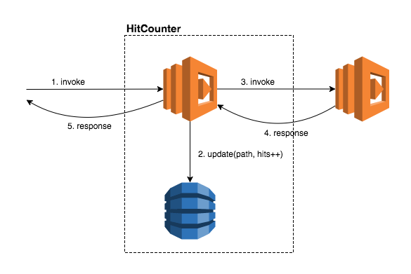

## Why CDK
* infrastructure as code
  * component reusability, portablity
  * version control, roll back to the previous verisoin
  * clean code architecture, rather than file based

## file structure
```shell
├── README.md
├── app.py
├── cdk.json
├── cdk.out
│   ├── asset.37966b8a9595e568ac5e3e185e2f1cff2f2959574d66a95e92dcfae7b6761931
│   │   └── hello.py
│   ├── cdk.out
│   ├── cdkworkshop.template.json
│   ├── manifest.json
│   └── tree.json
├── cdkworkshop
│   ├── __init__.py
│   ├── __pycache__
│   │   ├── __init__.cpython-38.pyc
│   │   ├── __init__.cpython-39.pyc
│   │   ├── cdkworkshop_stack.cpython-38.pyc
│   │   └── cdkworkshop_stack.cpython-39.pyc
│   ├── cdkworkshop.egg-info
│   │   ├── PKG-INFO
│   │   ├── SOURCES.txt
│   │   ├── dependency_links.txt
│   │   ├── requires.txt
│   │   └── top_level.txt
│   └── cdkworkshop_stack.py
├── hitcounter.py
├── lambda
│   ├── hello.py
│   └── hitcount.py
├── requirements.txt
├── setup.py
├── source.bat
└── tests
    ├── __init__.py
    └── unit
        ├── __init__.py
        └── test_cdkworkshop_stack.py

```
### Architeucture



## code structure

### Constructor
* level 1
* level 2 

### path
* path

### Token


## commands
* cdk ls
* cdk synth
* cdk bootstrap: when have to use bootstrap
* cdk deploy
* cdk diff
